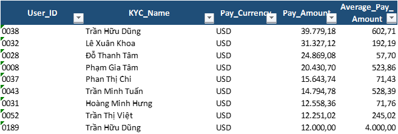
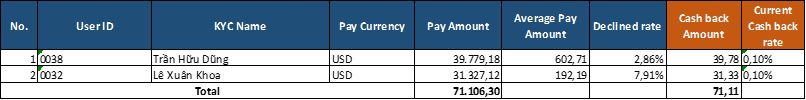

## Mục lục

- [Tổng quan về Dự án](#Tổng-quan-về-Dự-án)
  - [Thể lệ của chương trình hoàn tiền](#thể-lệ-của-chương-trình-hoàn-tiền:)
  - [Nguyên tắc hoàn tiền](#nguyên-tắc-hoàn-tiền)
- [Hướng dẫn sử dụng](#Hướng-dẫn-sử-dụng)
  - [Cài đặt](#Cài-đặt)
  - [Cấu trúc file báo cáo](#Cấu-trúc-file-báo-cáo:)
  - [Các bước chạy báo cáo](#Các-bước-chạy-báo-cáo:)
- [Chi tiết về dự án](#Chi-tiết-về-dự-án)
  - [Cấu trúc File](#Cấu-trúc-File)
  - [Cấu trúc câu lệnh chạy tự động](#Cấu-trúc-câu-lệnh-chạy-tự-động)
  - [Khả năng nâng cấp](#Khả-năng-nâng-cấp)
- [Góp ý và đóng góp](#Góp-ý-và-đóng-góp) 
- [Lưu ý](#Lưu-ý)

## Tổng quan về Dự án
Dự án dự trên yêu cầu xử lý dữ liệu khách hàng cho Chương trình:  "Hoàn tiền (Cashback) cho các khách hàng sử dụng thẻ ảo - Virtual credit card (VCC) 
### Thể lệ của chương trình hoàn tiền:
- **Chỉ tiêu xét hoàn tiền:** Là Tổng số tiền chi tiêu đã được quy đổi về USD trong một kỳ sao kê (Kỳ sao kê: Tính được từ ngày đầu tiên đến ngày cuối cùng của tháng). Chỉ tiêu xét hoàn tiền phải đạt giá trị nhỏ nhất được hoàn tiền (có tỷ lệ hoàn tiền > 0)
- **Tỷ lệ giao dịch thất bại:** Tỷ lệ giao dịch thất bại trong một kỳ sao kê thấp hơn 10%
- **Giá trị trung bình của mỗi giao dịch - Average Transaction Value (ATV):** ATV phải đạt trên 100 USD
### Nguyên tắc hoàn tiền 
Khách hàng đáp ứng được thể lệ chương trình sẽ được hoàn tiền theo công thức sau:
<p align="center">
<b>Giá trị hoàn tiền (Cashback Amount) = Chỉ tiêu xét hoàn tiền * Tỷ lệ hoàn tiền</b>
</p>
Trong đó, Tỷ lệ hoàn tiền được xác định bằng Chỉ tiêu hoàn tiền theo bảng sau: <br>

| STT  | Chỉ tiêu xét hoàn tiền                                       | Tỷ lệ hoàn tiền |
|------|--------------------------------------------------------------|-----------------|
| 1    | Từ 20,000 USD đến dưới 50,000 USD                            | 0.1%            |
| 2    | Từ 50,000 USD đến dưới 100,000 USD                           | 0.3%            |
| 3    | Từ 100,000 USD đến dưới 500,000 USD                          | 0.4%            |
| 4    | Từ 500,000 USD đến dưới 1,000,000 USD                        | 0.5%            |
| 5    | Từ 1,000,000 USD đến dưới 5,000,000 USD                      | 0.6%            |
| 6    | Trên 5,000,000 USD                                           | 0.7%            |

[🔝 Quay về đầu](#mục-lục)

## Hướng dẫn sử dụng
Dự án được đóng gói và chạy hoàn toàn tự động trong file Excel dạng xlsb

### Cài đặt
Để có thể sử dụng được Báo cáo tự động, các bạn sẽ cần bật VBA trong Excel theo hướng dẫn của Microsoft [tại đây](https://support.microsoft.com/en-us/office/enable-or-disable-macros-in-microsoft-365-files-12b036fd-d140-4e74-b45e-16fed1a7e5c6)

### Cấu trúc file báo cáo:
```
Cashback Report for date of 2025.06.xlsb/
├── Report/     # Báo cáo khách hàng được hoàn tiền trong kỳ báo cáo
├── Check1/     # Bước 1: Tính Chỉ tiêu xét hoàn tiền và Giá trị trung bình của mỗi giao dịch
├── Check2/     # Bước 2: Tính tỷ lệ giao dịch thất bại
├── Check3/     # Bước 3: Tổng hợp dữ liệu về 3 chỉ tiêu đã được tính tại Bước 1 và Bước 2, kiểm tra các khách đủ điều kiện được hoàn tiền
├── Auth/       # Dữ liệu đầu vào: Dữ liệu về Authorization Transaction
├── Settle/     # Dữ liệu đầu vào: Dữ liệu về Settlement Transaction
└── Note        # Bao gồm nút Run để chạy báo cáo, câu lệnh Query VBA, Kỳ báo cáo và các điều kiện để hoàn tiền
```
### Các bước chạy báo cáo:
- Bước 01: Đưa dữ liệu đầu vào của Authorization Transaction và Settlement Transaction tương ứng vào 2 sheet Data: Auth và Settle.
- Bước 02: Thay đổi các thiết lập về điều kiện (Nếu cần) tại sheet Note:
+ Chỉ tiêu xét hoàn tiền: Tại ô B32 và C32
+ Tỷ lệ giao dịch thất bại: Tại ô B30 và C30
+ Giá trị trung bình của mỗi giao dịch: Tại ô B31 và C31
- Bước 03: Thay đổi tỷ lệ hoàn tiền: Thiết lập điều kiện tại vùng B36:D43
- Bước 04: Thay đổi kỳ báo cáo:
+ Ngày: Tại ô B22 (Thường sẽ điền là ngày cuối cùng của tháng)
Chú ý: Nếu cần báo cáo theo ngày (không là toàn bộ tháng) thì tích "v" tại ô D22, mặc định là không tích.
+ Tháng: Tại ô B23
+ Năm: Tại ô B24
- Bước 5: Chọn nút **RUN** để chạy báo cáo

[🔝 Quay về đầu](#mục-lục)

## Chi tiết về dự án
### Cấu trúc File
```
Cash back Project/
├── Code/                            # Folder tổng chứa phần code VBA và query SQL được tách riêng để dễ theo dõi
│   ├── Cashback Query.sql           # File chứa toàn bộ query SQL được sử dụng trong Project
│   └── Cashback VBA.bas             # File chứa toàn bộ code VBA được sử dụng trong Project
├── Data/
│   └── Data.xlsx                    # Dữ liệu sample đầu vào để chạy thử cho Project
├── image/                           # Thư mục chứa hình ảnh minh họa
├── Report/
│   └── Cashback Report for date of 2025.06.xlsb   # Báo cáo hoàn thiện đã được đóng gói gồm Code và Data
└── README.md                        # Tài liệu hướng dẫn
```

### Cấu trúc câu lệnh chạy tự động
Cấu trúc của câu lệnh được được chia thành 3 sub chính
```
AllStep/
├── Step1/                 # Chương trình con để tạo sheet Check1
│   ├── SQL_check1         # Sử dụng VBA để dùng ADO SQL đê lấy dữ liệu trên sheet1
│   └── Check1             # Sử dụng VBA để tự động tạo công thức hàm để kiêm tra lại kết quả Query
├── Step2/
│   ├── SQL_check2         # Sử dụng VBA để dùng ADO SQL đê lấy dữ liệu trên sheet2
│   └── Check2             # Sử dụng VBA để tự động tạo công thức hàm để kiêm tra lại kết quả Query
└── Step3/
    ├── Check3             # Sử dụng VBA để tự động gộp dữ liệu sheet1, sheet2, kiểm tra các khách đủ điều kiện được hoàn tiền và số tiền được hoàn
    └── SQL_Report         # Sử dụng SQL để Query các trường hợp đủ điều kiện được hoàn tiền
```

Trong đó:
- Nhóm chương trình con VBA: SQL_check1, SQL_check2, SQL_Report đều sử dụng các câu để gọi ADO SQL chỉ đến ô dữ liệu chứa câu lệnh Query SQL:
+ **SQL_check1**: Chỉ đến câu Query SQL tại ô A13 tại sheet Note
```sql
SELECT S.User_ID,S.KYC_Name,S.Pay_Currency,SUM(S.Pay_Amount),AVG(S.Pay_Amount) 
FROM [Settle$] S 
GROUP BY S.User_ID,S.KYC_Name,S.Pay_Currency  
ORDER BY SUM(S.Pay_Amount) DESC										
```


+ **SQL_check2**: Chỉ đến câu Query SQL tại ô A16 tại sheet Note
```sql
SELECT User_ID,KYC_Name,SUM(IIF(Status=""DECLINED"",1,0)),SUM(1),SUM(IIF(Status=""DECLINED"",1,0))/SUM(1)
FROM [Auth$] 
GROUP BY User_ID,KYC_Name 
ORDER BY User_ID ASC										
```


+ **SQL_Report**: Chỉ đến câu Query SQL tại ô A19 tại sheet Note
```sql
SELECT User_ID,KYC_Name,Pay_Currency,Pay_Amount,Average_Pay_Amount,Declined_rate,Cash_back_Amount,Current_Cash_back_rate 
FROM [Check3$] 
WHERE Check_conditions=TRUE 
ORDER BY Pay_Amount DESC										
```



### Khả năng nâng cấp
- Báo cáo linh hoạt trong trường hợp các điều kiện và tỷ lệ hoàn tiền thay đổi.
- Dễ dàng tuỳ biên để lấy dữ liệu trừ 1 file độc lập riêng biệt

[🔝 Quay về đầu](#mục-lục)

## Góp ý và đóng góp
Rất hy vọng nhận được góp ý và đóng góp của mọi người để hoàn thiện hơn
Mọi góp ý và đóng góp xin gửi về: buithanhbinh55.aof@gmail.com

## Lưu ý
Dữ liệu được sử dụng tại Báo cáo là dữ liệu mẫu, đã được chuẩn hoá để có thể tương thích với dữ liệu thực tế

[🔝 Quay về đầu](#mục-lục)